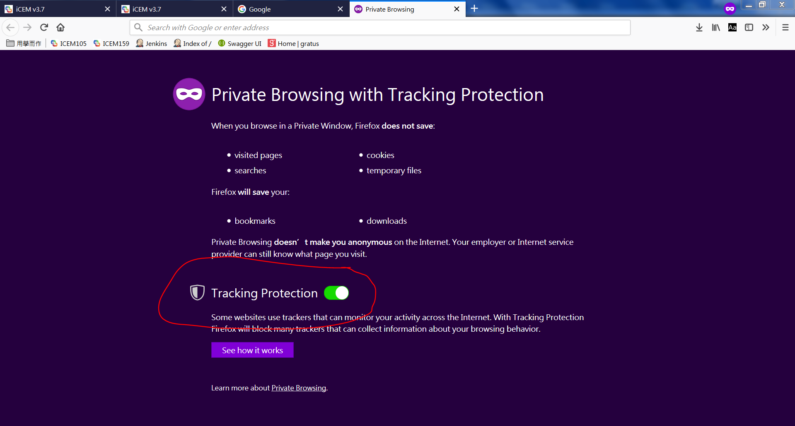

# __Manual Testing Memo__

## __ICEM 的 Domain name__
>Domain name: http://icem.retair.com/icem-manager/index.html#!/

impression的意義在於:"曝光",消費者有沒有看到這項產品
click的意義在於:看見曝光後是否有點進商品
conversion意義在於:消費者有沒有購買 放入購物車...比較重要的一些行為

## __Cassandra__

### Cassandra變色!  
source ~/tmp/bashrc

### 連接cassadra看table資料
帳號:root  
密碼:retair9999  
cd /usr/local/apache-cassandra/bin  
./cqlsh  
use icem;  

### 看log有沒有打進去  
cd /data/nginx  
tail access-action.log
tail -f 檔案名 可以即時監控

ICEM中做任何動作都可以在這邊找到log
/root/DMP/apache-tomcat-8.0.33/logs
log 在 agent.log

>有些 table 是 counter table 必須要用 update 指令去累加  
Insert 則是直接設定數字

## __Recommendation__
Recommendation中,visit的推薦是針對item的visit次數做推薦
e.g. visit設定 click count < 15,則在 cassandra 中 recommend_member_aggregate_counter ,  
在推薦的item list中,當某個 retuid 的 clkitem 的 clknum < 15時 就會被推薦出來
 
Attirubte:
When upload file contains attribute:jogging,but taxonomy doesnt set attribute:jogging.  
Recommendation's attribute can see attribute:jogging.  
Because of Service team want to upload first and then set what attribute they really need to use.

## __Social Media__

set cookie on PC to test weixin

RET.cookieObj.setLocalCookie("wx2db92c8137ccdcd3__wopenid", "oNUgCsziFnuwCkW0LcYfUfO84vfo", 365 );
RET.cookieObj.setLocalCookie("__retuid", "2f712d1d-114a-933b-48fe-cdf1bbb41a", 365 );	
RET.cookieObj.setLocalCookie("joeliao_account", "Please", 365 );
RET.cookieObj.setLocalCookie("isLoginjoeliao_account", "1",365 );
RET.cookieObj.setLocalCookie("siteMember-1476", "Please", 365 );

### Delete cookie
在不同應用程式上有不同的cookie,就像不同瀏覽器那樣,事實上就是每個應用程式有自己獨立的瀏覽器
deleteca :  登入这个，清除手机上的cookie
http://icemdev.retchat.com/demo/deleteCache.html?test=123123

showcache : 展示当前手机上的cookie
http://icemdev.retchat.com/demo/showCache.html

在 retclub上的(線上環境) :
deleteca :
http://retclub.retchat.com/retclub/2/0/92

showcache :
http://retclub.retchat.com/retclub/2/0/91

## __Audience segment__
>在新增Audience Segment 時有6種不同rule可以選擇,分別是Taxonomy,CustomField,ScoreRule,ItemCode,RFM model,Keyword  
除了Keyword的部分目前無法用打log方式讓它產生資料,其他都要先打log  
其中Score rule with 
>1. score 就是看 rule 的 score
>2. ranking 就是看 score 的排名
>3. percentage 則是 score 排名後再做百分率,都是介於百分 0 ~ 100 之間

>比如:  
>select * from icem_member_score where site_id=1668;  

| retuid | score |  
| ------ | ----- |  
| 58c76ff6-275c-c185-83b1-c7eec4634c05 | 0 |
| MANUAL-68ad80a9-ca70-4209-aa9d-f469d4fa4250 | 0 |
| MANUAL-6bea140c-5273-4856-9b39-af9003f18b05 | 5 |
| MANUAL-8c27d70f-c12d-41c4-9c63-2eca56e8c07f | 30 |

>select * from (SELECT retuid, rank() OVER (ORDER BY score DESC) AS value FROM icem_member_score where site_id=1668 and ruleId=9025 ) as member_score;

| retuid | score |
| ------ | ----- |
| MANUAL-8c27d70f-c12d-41c4-9c63-2eca56e8c07f | 1 |
| MANUAL-6bea140c-5273-4856-9b39-af9003f18b05 | 2 |
| 58c76ff6-275c-c185-83b1-c7eec4634c05 | 3 |
| MANUAL-68ad80a9-ca70-4209-aa9d-f469d4fa4250 | 3 |

>select * from (SELECT retuid, percent_rank() OVER (ORDER BY score DESC) AS value FROM icem_member_score where site_id=1668 and ruleId=9025 ) as member_score;

| retuid | score |
| ------ | ----- |
| MANUAL-8c27d70f-c12d-41c4-9c63-2eca56e8c07f | 0.0 |
| MANUAL-6bea140c-5273-4856-9b39-af9003f18b05 | 0.3333333333333333 |
| 58c76ff6-275c-c185-83b1-c7eec4634c05 | 0.6666666666666666 |
| MANUAL-68ad80a9-ca70-4209-aa9d-f469d4fa4250 | 0.6666666666666666 |
-----------------------------------
Keyword目前只能把資料硬塞進cassandra來做測試
塞資料進cassandra (keyword)
>UPDATE recommend_keyword_member_aggregate_counter  
SET impressionnum=impressionnum+1  
WHERE siteid=1668 and retuid='MANUAL-6bea140c-5273-4856-9b39-af9003f18b05' and keyword='ktest';

>Preconditions:
>Keyword 要先到Items新增設定:ktest

-------------- 打log --------------

此範例都為打(member2:Female)(item:it1) event tag 的click log

PS:下面網址要換成自己site的資料

CustomField的log:
1. 進入Event tag頁面-> See all snippet code
2. 輸入Custom:Custom Field:test, Custom Field Value:123
3. 點選Apply後複製網址 
`http://icemdev.retchat.com/t/?a=1668&catclk=18-6840120040&cert=d2f0cb6e0e064d2265c27cc4622d1246&app=WEB&ext=%7B%22test%22%3A%22123%22%7D&retUid=MANUAL-6bea140c-5273-4856-9b39-af9003f18b05`

ItemCode的log:
1. 進入Event tag頁面-> See all snippet code
2. 複製網址
3. 加入vItemId, vItemId是item code  EX:vItemId=101
`http://icemdev.retchat.com/t/?a=1668&catclk=18-6840120040&cert=d2f0cb6e0e064d2265c27cc4622d1246&app=WEB&vItemId=101&retUid=MANUAL-6bea140c-5273-4856-9b39-af9003f18b05`

RFM model的log:
1. 進入Event tag頁面-> See all snippet code
2. 複製網址
`http://icemdev.retchat.com/t/?a=1668&catclk=18-6840120040&cert=d2f0cb6e0e064d2265c27cc4622d1246&app=WEB&retUid=MANUAL-6bea140c-5273-4856-9b39-af9003f18b05`

Score Rule的log:
1. 進入Event tag頁面-> See all snippet code
2. 複製網址
3. 加入siteMember, siteMember就是member的name, EX:siteMember=member2
`http://icemdev.retchat.com/t/?a=1668&catclk=18-6840120040&cert=d2f0cb6e0e064d2265c27cc4622d1246&app=WEB&siteMember=member2&retUid=MANUAL-6bea140c-5273-4856-9b39-af9003f18b05`

## __Detail Report -> COMMODITY ANALYTICS__
>http://icemdev.retchat.com/action/action.img?t=1517886742877&retUid=ec0affda-7e3a-4040-8376-705d2675b096&siteId=1208&retType=buy&app=WEB&sessionId=fSes-63d1b0fd-33c9-90d2-31ed&t=1517886742877&retCrt=c54c1040d15d563cad59e94d14bfa256&&shopDetail={itemCode}%2C{Price}%2C{Quantity}

## __Detail Report -> SHOPPING CART ANALYTICS__
>http://icemdev.retchat.com/action/action.img?t=1517886742877&retUid=ec0affda-7e3a-4040-8376-705d2675b096&siteId=1208&retType=cart&app=WEB&sessionId=fSes-63d1b0fd-33c9-90d2-31ed&retCrt=c54c1040d15d563cad59e94d14bfa256&&cartDetail={itemCode}%2C{Price}%2C{Quantity}

## __Content Analytics -> FORUM ID ANALYSIS__
>Impression的retType=track  
click的retType=retClk  
需要到Items中找出Forum ID!  
http://icemdev.retchat.com/action/action.img?t=1517886742877&retUid=ec0affda-7e3a-4040-8376-705d2675b096&siteId=1208&app=WEB&sessionId=fSes-63d1b0fd-33c9-90d2-31ed&retType=track&retCrt=c54c1040d15d563cad59e94d14bfa256&&fid={ForumID}
## __Content Analytics -> Title Based Analytics__
>Impression:  
http://icemdev.retchat.com/action/action.img?t=1527498697207&retUid=1f1c4536-0616-40dc-9213-df29bfc26f76&siteId=1841&app=WEB&sessionId=fSes-6ed9b0f4-e8e2-231e-3079&retType=track&retCrt=9704a410871b809e50d196cd82b12cad&vItemId=002&recDomId=rec_reminder1&recommendId=9716&tid=9527

>click不知道是怎樣打

## __Event DIY Label Report__
>需要到Event tag的EXT Filter設置打入log的ext才會跑出資料  
Ex:打入的ext:麥當勞(大麥克),filter就要新增”麥當勞”

## __Campaign Pixel Conversion Setting__

>Campaign pixel打conversion的log時有特別規則  
需要到Miscellaneous設定Attribute Model 

Campaign 的 Redirect URL status code 會是302

## __Target Sync Data流程__

打進 Log  
-> fastdata 每小時30分時會寫入  
-> behavior table  
-> fastdata hourly run 將 table 寫成一個.csv 檔  
-> dmp scheduler 整點時會將此.csv 寫入 target database

Host:danone.retchat.com
Port:5432
User Name:gpadmin 
Password:DN65$321
DB:danone
Schema:behavior

Taxonomy:
Demographic-Age :{"25-44","20-39"}
Demographic-Gender {"M","F"}
Demographic-Location {"CN","HK"}
Interested_In_Parenting {"Parenting1"}
Parental_Status-Pregnant {"Pregnant1"}
Parenting-Brain_Development {"Development1"}
Parenting-Easy_Digestion {"Digestion1"}
Parenting-Future_Health {"Health1"}

## __Source Sync Data流程__

.csv經過dmp scheduler daily run  
-> Cassandra 的 dmp_user_profile, dmp_user_profile_segment … 等table

## __Macro 打 log 新增 Audience 的 Attribute__
log範例: 
http://icemdev.retchat.com/p/?a=1720&catclk=18-11605781419&cert=c0ae88123e7a142a1d5216d6bb173c85&app=WEB&retUid=MANUAL-26b3464e-c1f8-4f74-b18f-8ffce869c374&ckType=12&interest=shopping  
只能打系統預設好的macro name , 到 icem_dsp_macro 看

## EMAIL設定
>GMAIL的設定  
Mail Host : smtp.gmail.com  
Account : liaobosiang@gmail.com  
Password : ********

>RETAIR的  
Mail Host : mail.retair.com  
Account :　jliao　　
Password : retair

# __Robot framework memo__

>Robot framework 提取 list 中的 list  
@{items}=&emsp;set variable&emsp;${json["data"]["items"]}

>Reponse中:[…]這是list , {…}這是dictionary  

__Integ_data_query_report.robot中的check部分__

>__先從dictionary把content這個list拿出來__  
${response_content}&emsp;get_element&emsp;${query_report_response}&emsp;input_name=${None}&emsp;icem_name_param=${None}&emsp;icem_id_param=content&emsp;get_what=get_content  
__把content這個list從dictionary中拿出來__    
${content_list}&emsp;get from list&emsp;${response_content}&emsp;0  
__拿出conversion這個element__  
${conversion}&emsp;get_element&emsp;${content_list}&emsp;input_name=${None}&emsp;icem_name_param=${None}&emsp;icem_id_param=conversion&emsp;get_what=get_conversion  
__變成數字__  
${conversion_log_times}&emsp;evaluate&emsp;${conversion_log_times}&emsp;should be equal&emsp;${conversion}&emsp;${conversion_log_times}

test
    [Documentation]  open browser chrome and go to ICEM login
    Open Browser    http://icem.retair.com/icem-manager/index.html#!/    Chrome
    sleep    5
    Input Text    //input[@ng-model="user.loginId"]    joeliao
    Input Text    //input[@ng-model="user.password"]    retair
    Click Button    //button[@ng-disabled="loginButton"]

## __Social Media__

appId,appSecret是必要的,因為要跟微信拿toke必須用到
publicId為非必要填入因為我們無法知道正確性
就算填假的,也只有在發送message,手機收不到才能知道是否為假的
e.g.送出去API雖然為200但不知道那邊有沒有成功運作
mechantId應該為payment用到的

熱帖網
帳號：support@retair.com
密碼：123456

appId： wx2db92c8137ccdcd3
appSecret: b8f4d1e5d2604dff91bb4ab917acf451
publicId:  gh_54b5d05b7b89
merchantId : 12386517

樂愛創意
帳號：mfan@retair.com
密碼： 123456
appId ： wx9e3ed7106f932c72
appSecret : d4829e8e9c17eef3dafab8682949197a
publicId :  gh_f82b8f91f362
merchantId : 12386480

https://retclub.retchat.com/agent/weixin/callback/event?publicId=gh_f82b8f91f362

LINE

APP ID : 1561704221
APP secret : 0a19c890689bc5969138901776da0d84
message ID : 1561704378
message secret : c6479c83ab91245384a40357e98491e8

## Third-party tag
Google

head
<!-- Google Tag Manager -->

<!-- End Google Tag Manager -->

body
<!-- Google Tag Manager (noscript) -->
<noscript><iframe src="https://www.googletagmanager.com/ns.html?id=GTM-PCHV7GL"
height="0" width="0" style="display:none;visibility:hidden"></iframe></noscript>
<!-- End Google Tag Manager (noscript) -->

用 Firefox 無痕模式測試 google third party tag
如果有打開 tracking protection 的話會無法發出 log

rulebase 根據設置的規則做推薦

browsinghistory 根據該用戶曾經瀏覽過的商品,推薦給該用戶
  recommend_ibh_user_to_item_clickstream_result
  recommend_ibh_user_to_item_conversion_result
    userId | result
    11f5e809-b6d2-dd9c-a2fc-eeaae9efa0d6 | [{itemcode: 'a004', score: 3, flag: 0}]

reminder 該用戶以前買過，過一定時間後提示再買
  recommend_reminder_user_to_item_result
    userId | result
    4b50dd94-6d9-7039-3c4e-376b40d858d8 | [{itemcode: 'a001', score: -1, flag: 0}]

userauto 根據該用戶的特性 (EX :男或女) 自動做推薦給該用戶
  recommend_user_to_item_clickstream_result
  recommend_user_to_item_conversion_result
    userId | result
    11f5e809-b6d2-dd9c-a2fc-eeaae9efa0d6 | [{itemcode: 'a002', score: 87.73685, flag: 0}]

itemauto 根據所有用戶點選或購買的商品,自動推薦商品給該用戶
  recommend_item_to_item_clickstream_result
  recommend_item_to_item_conversion_result
    itemCode | result
    a001 | [{itemcode: 'a002', score: 3, flag: 1}]

ranking 根據所有用戶購買商品次數,做一個商品排名,然後推薦給該用戶
  recommend_rank_item_to_item_clickstream_result
  recommend_rank_item_to_item_conversion_result
    itemCode | result
    0 | [{itemcode: 'a002', score: 4, flag: 0}]

buyafterviewing 根據所有用戶看過,然後購買的商品,推薦給該用戶
  recommend_bav_item_to_item_result
    itemCode | result
    B05737E | [{itemcode: 'C07308J', score: 0.5, flag: 0}, {itemcode: 'F06020R', score: 0.5, flag: 0}]

