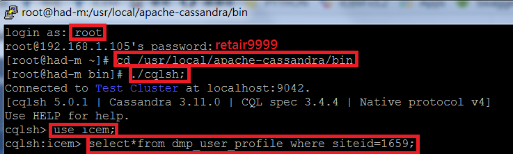

# __Manual Testing Memo__

## __ICEM 的 Domain name__
>Domain name: http://icem.retair.com/icem-manager/index.html#!/

## __Cassandra__

## 連接cassadra看table資料
帳號:root  
密碼:retair9999  
cd /usr/local/apache-cassandra/bin  
./cqlsh  
use icem;  

## 看log有沒有打進去  
cd /data/nginx  
tail access-action.log

>有些 table 是 counter table 必須要用 update 指令去累加  
Insert 則是直接設定數字

塞資料進cassandra (keyword)
>UPDATE recommend_keyword_member_aggregate_counter  
SET impressionnum=impressionnum+1  
WHERE siteid=1668 and retuid='MANUAL-6bea140c-5273-4856-9b39-af9003f18b05' and keyword='ktest';

## __Recommendation__

## __Audience segment__
>Audience segment 有6種 rule  
其中Score rule with 
>1. score 就是看 rule 的 score
>2. ranking 就是看 score 的排名
>3. percentage 則是 score 排名後再做百分率,都是介於百分 0 ~ 100 之間

>比如:  
>select * from icem_member_score where site_id=1668;  

| retuid | score |  
| ------ | ----- |  
| 58c76ff6-275c-c185-83b1-c7eec4634c05 | 0 |
| MANUAL-68ad80a9-ca70-4209-aa9d-f469d4fa4250 | 0 |
| MANUAL-6bea140c-5273-4856-9b39-af9003f18b05 | 5 |
| MANUAL-8c27d70f-c12d-41c4-9c63-2eca56e8c07f | 30 |

>select * from (SELECT retuid, rank() OVER (ORDER BY score DESC) AS value FROM icem_member_score where site_id=1668 and ruleId=9025 ) as member_score;

| retuid | score |
| ------ | ----- |
| MANUAL-8c27d70f-c12d-41c4-9c63-2eca56e8c07f | 1 |
| MANUAL-6bea140c-5273-4856-9b39-af9003f18b05 | 2 |
| 58c76ff6-275c-c185-83b1-c7eec4634c05 | 3 |
| MANUAL-68ad80a9-ca70-4209-aa9d-f469d4fa4250 | 3 |

>select * from (SELECT retuid, percent_rank() OVER (ORDER BY score DESC) AS value FROM icem_member_score where site_id=1668 and ruleId=9025 ) as member_score;

| retuid | score |
| ------ | ----- |
| MANUAL-8c27d70f-c12d-41c4-9c63-2eca56e8c07f | 0.0 |
| MANUAL-6bea140c-5273-4856-9b39-af9003f18b05 | 0.3333333333333333 |
| 58c76ff6-275c-c185-83b1-c7eec4634c05 | 0.6666666666666666 |
| MANUAL-68ad80a9-ca70-4209-aa9d-f469d4fa4250 | 0.6666666666666666 |

## __Detail Report -> COMMODITY ANALYTICS__
>http://icemdev.retchat.com/action/action.img?t=1517886742877&retUid=ec0affda-7e3a-4040-8376-705d2675b096&siteId=1208&retType=buy&app=WEB&sessionId=fSes-63d1b0fd-33c9-90d2-31ed&t=1517886742877&retCrt=c54c1040d15d563cad59e94d14bfa256&&shopDetail={itemCode}%2C{Price}%2C{Quantity}

## __Detail Report -> SHOPPING CART ANALYTICS__
>http://icemdev.retchat.com/action/action.img?t=1517886742877&retUid=ec0affda-7e3a-4040-8376-705d2675b096&siteId=1208&retType=cart&app=WEB&sessionId=fSes-63d1b0fd-33c9-90d2-31ed&retCrt=c54c1040d15d563cad59e94d14bfa256&&cartDetail={itemCode}%2C{Price}%2C{Quantity}

## __Content Analytics -> FORUM ID ANALYSIS__
>Impression的retType=track  
click的retType=retClk  
需要到Items中找出Forum ID!  
http://icemdev.retchat.com/action/action.img?t=1517886742877&retUid=ec0affda-7e3a-4040-8376-705d2675b096&siteId=1208&app=WEB&sessionId=fSes-63d1b0fd-33c9-90d2-31ed&retType=track&retCrt=c54c1040d15d563cad59e94d14bfa256&&fid={ForumID}
## __Content Analytics -> Title Based Analytics__
>Impression:  
http://icemdev.retchat.com/action/action.img?t=1527498697207&retUid=1f1c4536-0616-40dc-9213-df29bfc26f76&siteId=1841&app=WEB&sessionId=fSes-6ed9b0f4-e8e2-231e-3079&retType=track&retCrt=9704a410871b809e50d196cd82b12cad&vItemId=002&recDomId=rec_reminder1&recommendId=9716&tid=9527

>click不知道是怎樣打

## __Event DIY Label Report__
>需要到Event tag的EXT Filter設置打入log的ext才會跑出資料  
Ex:打入的ext:麥當勞(大麥克),filter就要新增”麥當勞”

## __Campaign Pixel Conversion Setting__

>Campaign pixel打conversion的log時有特別規則  
需要到Miscellaneous設定Attribute Model 

## __Target Sync Data流程__

打進 Log  
-> fastdata 每小時30分時會寫入  
-> behavior table  
-> fastdata hourly run 將 table 寫成一個.csv 檔  
-> dmp scheduler 整點時會將此.csv 寫入 target database

## __Source Sync Data流程__

.csv經過dmp scheduler daily run  
-> Cassandra 的 dmp_user_profile, dmp_user_profile_segment … 等table

## __Macro 打 log 新增 Audience 的 Attribute__
log範例: 
http://icemdev.retchat.com/p/?a=1720&catclk=18-11605781419&cert=c0ae88123e7a142a1d5216d6bb173c85&app=WEB&retUid=MANUAL-26b3464e-c1f8-4f74-b18f-8ffce869c374&ckType=12&interest=shopping  
只能打系統預設好的macro name , 到 icem_dsp_macro 看

# __Robot framework memo__

>Robot framework 提取 list 中的 list  
@{items}=&emsp;set variable&emsp;${json["data"]["items"]}

>Reponse中:[…]這是list , {…}這是dictionary  

__Integ_data_query_report.robot中的check部分__

>__先從dictionary把content這個list拿出來__  
${response_content}&emsp;get_element&emsp;${query_report_response}&emsp;input_name=${None}&emsp;icem_name_param=${None}&emsp;icem_id_param=content&emsp;get_what=get_content  
__把content這個list從dictionary中拿出來__    
${content_list}&emsp;get from list&emsp;${response_content}&emsp;0  
__拿出conversion這個element__  
${conversion}&emsp;get_element&emsp;${content_list}&emsp;input_name=${None}&emsp;icem_name_param=${None}&emsp;icem_id_param=conversion&emsp;get_what=get_conversion  
__變成數字__  
${conversion_log_times}&emsp;evaluate&emsp;${conversion_log_times}&emsp;should be equal&emsp;${conversion}&emsp;${conversion_log_times}

